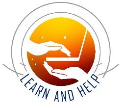

<p align="center">
  
</p>

<h1 align="center">🐍 Python 101 — Recap</h1>

<h3 align="center">Chapters 1–9 &amp; Core Data Structures</h3>

<p align="center">
  <b>Learn and Help</b> <br>
  <i>Empowering Minds, Inspiring Generosity!</i><br>
  <sub>Python Programming by <b>Siva Jasthi</b> · Bridge notes for <b>Python for Data Science</b></sub>
</p>

---

## 🗺️ Roadmap

| # | Chapter | Big Idea |
|:-:|---------|----------|
| 1 | Introduction | How computers & languages work |
| 2 | Input, Processing, Output | Variables, types, operators |
| 3 | Conditions | Making decisions |
| 4 | Loops | Repeating work |
| 5 | Functions | Reusable building blocks |
| 6 | Files & Exceptions | Reading data safely |
| 7 | Lists & Tuples | Ordered collections |
| 8 | Strings | Text as a character list |
| 9 | Sets & Dictionaries | Unique items & key-value pairs |
| ➕ | Misc. | Binary, built-ins, keywords |

---

# 1️⃣ Introduction

> **A computer executes a set of instructions.** &nbsp; Remember **IPO** → **I**nput · **P**rocessing · **O**utput

### ⚙️ Interpreter vs. Compiler

| | 🟢 Interpreter | 🔵 Compiler |
|---|---|---|
| **How it works** | Runs the code right away | Translates source code → machine code first |
| **On an error** | Stops execution when it hits the error | Only works if source code is error-free |
| **Then…** | — | The computer runs the machine code |

### 🗣️ Parts of a Language

| Part | Meaning | Example |
|------|---------|---------|
| **Alphabet** | Basic symbols | a, b, c |
| **Lexis** | The dictionary (words) | — |
| **Syntax** | Correct structure | ✅ *Alex went to school* · ❌ *Alex school to went* |
| **Semantics** | Correct meaning | ❌ *School went to Alex* |

### 📚 Types of Languages & Code

| Types of Languages | Types of Code |
|--------------------|---------------|
| **Natural** – what we speak | **Pseudo code** – steps in plain English |
| **Programming** – how humans talk to machines | **Source code** – written in a high-level language |
| **Low-level** – machine / Assembly | **Binary (machine) code** – meant for computers |
| **High-level** – Python, Java, C, JS, C# | |

### 🐍 About Python
- ✅ A **high-level** programming language
- ✅ An **interpreted** language
- ✅ Simple *and* powerful — great for scripting, testing & more
- ✅ Built on **C** underneath; **CPython** is the reference implementation

---

# 2️⃣ Input, Processing & Output (IPO)

### 🧱 Data Types

| Basic | Advanced |
|:-----:|:--------:|
| `int` · `float` · `str` · `bool` | `list` · `tuple` · `set` · `dict` |

### 🔑 Python Keywords (33 on the slide)

| Category | Keywords |
|----------|----------|
| **Value** | `True` `False` `None` |
| **Operator** | `and` `or` `not` `in` `is` |
| **Control flow** | `if` `elif` `else` |
| **Iteration** | `for` `while` `break` `continue` `else` |
| **Structure** | `def` `class` `with` `as` `pass` `lambda` |
| **Returning** | `return` `yield` |
| **Import** | `import` `from` `as` |

### 📦 Variables vs. Constants

| | Variables | Constants |
|---|-----------|-----------|
| **Value** | Can change | Do **not** change |
| **Naming** | `lowercase_snake_case` → `student_name` | `ALL_UPPER_CASE` → `INTEREST_RATE` |
| **Rules** | No keywords, spaces, or symbols | Same rules |

> 🔎 **Three things matter for every variable:** **1. name · 2. value · 3. data type**
> - `type(var)` → your friend for the **data type**
> - `print(var)` → your friend for the **value**

### ⬇️ ⬅️ How Python Reads Code
- **TOP → BOTTOM:** a variable must exist *before* you use it
  ```python
  A = 10; B = 20
  C = A + B        # OK
  X = A + B + D    # ❌ D is not defined yet
  ```
- **RIGHT → LEFT** during assignment: the right side is calculated first
  ```python
  A = 2
  A = A + 1        # A is now 3
  A = A * A        # A is now 9
  ```

### 🛠️ Basic Functions

| Function | What it does |
|----------|--------------|
| `input()` | Gets input — **always returns a string** |
| `type()` | Tells you the type of a variable |
| `print(*args, sep=' ', end='\n')` | Displays output; many arguments & types allowed |

**Escape characters:** `\n` = new line · `\t` = tab

### 🔄 Data Conversion (Casting)

| From → To | Example |
|-----------|---------|
| str → int | `int("2")` |
| int → str | `str(2)` |
| str → float | `float('2.3')` |
| str → bool | `bool('True')` |

### ➕ Operators

| Operator | Symbol | Notes |
|----------|:------:|-------|
| Addition | `+` | |
| Subtraction | `-` | |
| Multiplication | `*` | |
| Modulus | `%` | Remainder |
| Float division | `/` | Result has decimals |
| Floor division | `//` | Integer result; rounds **down** |
| Exponentiation | `**` | Power |

**Shorthand assignment:** `a += 2` → `a = a + 2` · `a *= a` → `a = a * a`

> 🧮 **Precedence:** **PEMDAS** or **GEMS** (Group, Expo, Multi, Sub). *If in doubt, add parentheses!* &nbsp; `**` binds **right-to-left**; the rest bind left-to-right.

**Coding conventions:** ✍️ comment your code · 📏 use empty lines to separate blocks · 🎯 be consistent

---

# 3️⃣ Conditions

### ⚖️ Comparison Operators

| Operator | Meaning |
|:--------:|---------|
| `>` | Greater than |
| `<` | Less than |
| `>=` | Greater than or equal to |
| `<=` | Less than or equal to |
| `==` | Equal to |
| `!=` | Not equal to |

### 🧠 Logical Operators & Truth Tables

- **`and`** → *every* operand must be True
- **`or`** → *at least one* operand must be True
- **`not`** → negation

| A | B | `A and B` | `A or B` |
|:-:|:-:|:---------:|:--------:|
| True | True | ✅ True | ✅ True |
| True | False | ❌ False | ✅ True |
| False | True | ❌ False | ✅ True |
| False | False | ❌ False | ❌ False |

`not(True)` → **False** · `not(False)` → **True**

### 🔢 Truthiness
- `0` is always **False**
- `1` is always **True**
- Any **non-zero** value is also **True**

### ⚡ Short-Circuit (Short-Hand) Evaluation
- **and** → stops as soon as an expression is **False**
- **or** → stops as soon as an expression is **True**

| Code | Result |
|------|:------:|
| `a = 100 and 1` | `1` |
| `b = 0 and 100` | `0` |
| `c = 100 or 1` | `100` |
| `d = 0 or 1` | `1` |

### 🔍 Membership Operators
`in` · `not in` (the inverse of `in`)

### 🌳 Decision Structures
```
if
if … else
if … elif … else
if … elif … elif … elif … else
Nested conditions  (an if inside an if)
```
> 💡 Python reads **top to bottom**, and conditions **control the flow**. Nested conditions can often be replaced with **logical operators**.

---

# 4️⃣ Iterations (Loops)

### 🎲 Random Numbers
```python
import random
random.randint(a, b)   # a whole number between a and b
random.random()        # a decimal between 0 and 1
```

### 📏 The `range()` Function

| Form | Defaults |
|------|----------|
| `range(start, stop, step)` | — |
| `range(start, stop)` | `step = 1` |
| `range(stop)` | `start = 0`, `step = 1` |

### 🔁 `while` vs. `for`

| | `while` loop | `for` loop |
|---|--------------|-----------|
| **Type** | **Indefinite** — repeats while a condition holds | **Definite** — repeats over a range/sequence |
| **Forms** | `while condition:` | `for i in range(start, stop, step)` <br> · `for i in range(start, stop)` · `for i in range(stop)` · `for item in sequence` |
| **`break`** | Exit the loop (only valid *inside* a loop) | Exit the loop |
| **`continue`** | Jump back to the start of the loop | Jump to the next iteration |

> **Sequence** = list, tuple, set, dict, range (covered in Ch. 7)

### 💂 Sentinel
A **sentinel** is *a guard whose job is to keep watch* — a special value used in a `while`/`for` loop to signal it's time to `break` out.

### ➕ Loop `else`
An `else` block on a `for`/`while` loop runs **only if the loop finishes normally** — i.e., **without a `break`**.

---

# 5️⃣ Functions

> 🚗 **Analogy:** Calling Uber, or withdrawing money from a bank — *use the service without worrying how it works.*

### 🧩 Why Functions?
- Building blocks that help **code reuse**
- **Tested and proven**
- Use them and take their services for granted

### ✍️ Anatomy of a Function

| Piece | Details |
|-------|---------|
| **`def`** | Keyword that starts the definition (the *signature*) |
| **Name** | Every function has one |
| **Arguments / parameters** | Takes **0, 1, or N** inputs |
| **Return** | Gives back **0, 1, or N** outputs |

### 📞 Calling & Returning
- **Position and number** of arguments matter — a mismatch → **error**
- Functions **may** return a value; control **exits at the first `return`**
- ⚠️ Ignoring a return value is not good; using a return value of `None` is also not good

| Type | Behavior |
|------|----------|
| **Void-returning** | No `return` needed → returns `None` by default |
| **Value-returning** | Forget the `return`? → returns `None` by default |

### 🎛️ Ways to Pass Arguments

| Kind | How it works | Example |
|------|--------------|---------|
| **Positional** | Bound by **position** | `f(1, 2)` |
| **Optional (default)** | Use `=` for a default; optional params go **at the end**. *"If you pass a value, I use yours; if not, I use mine."* | `def f(a, b=10)` |
| **Keyword** | Order doesn't matter | `f(b=2, a=1)` |
| **Forced keyword** | Params after `*` **must** use keywords | `def method1(a, b, *, c, d)` → positional: a, b · keywords: c, d |
| **Varargs** | Any number of positional args | `def total(*nums)` → `total(1,2)`, `total(4,5,6,7)` |
| **Kwargs** | Any number of keyword args | `def f(**kwargs)` |

### 📮 Pass-by-Value: Scalars vs. Collections

| Data type | What the function gets | Effect on original |
|-----------|------------------------|--------------------|
| `int` `float` `str` `bool` (scalars) | A **copy** | ✅ Original **unchanged** |
| `list` `tuple` `set` `dict` | A copy of the **remote** — still points to the *same TV* | ⚠️ Changes **can** affect the original (for mutable types) |

### 🔭 Scope of Variables — **LEGB**

| Letter | Scope | Notes |
|:------:|-------|-------|
| **L** | **Local** | Inside the function; use the `global` keyword to change a global |
| **E** | **Enclosing** | Inner-function scope |
| **G** | **Global** | Module level |
| **B** | **Built-in** | `print`, `len`, … |

*Redefining a name locally* is called **shadowing** a global.

### 🆚 Built-in vs. User-Defined · Functions vs. Methods

| | Examples |
|---|----------|
| **Built-in function** | `print()` `input()` `len()` `sum()` |
| **User-defined function** | Anything *we* write |
| **Function** (owned by no one) | `len(some_list)` · `int(some_string)` |
| **Method** (owned by a data type) | `my_list.append(2)` · `set_1.union(set_2)` |

### 🎭 Abstraction
We care about **what** a function does — **not how** it does it. We only need its **name**, **arguments (inputs)**, and **return value (outputs)**.

---

# 6️⃣ Files & Exceptions

## 📁 6.1 Files *(not in PCEP)*

| Text files | Binary files |
|------------|--------------|
| ASCII — humans can read | jpeg, png — machines read |

**Paths**
- **Relative:** `gasprices.txt` or `data\gasprices.txt`
- **Absolute:** `C:\users\srj\MyDocuments\gasprices.txt`

### 📖 The File I/O Pattern: **Open → Process → Close**

| Open mode | Meaning |
|:---------:|---------|
| `r` | **Read** (default) |
| `w` | Write |
| `a` | Append |
| `x` | Create |

| Read method | What it does |
|-------------|--------------|
| `read()` | Entire file in one go |
| `read(n)` | `n` characters at a time |
| `readline()` | One line at a time |
| `readlines()` | All lines into a **list** |

### 🔒 With vs. Without `with`

| ✅ With `with` | ⚠️ Without `with` |
|---------------|-------------------|
| Python manages the resource — no need to close | **You** must close the file |
| ```with open(FILE_NAME) as quotes_file_obj:``` | ```file_obj = open(file_name)``` <br> ```file_obj.close()``` |

## 🚨 6.2 Exceptions — *Things can go wrong!*

| Block | Purpose |
|-------|---------|
| **`try`** | ▶️ Run this code |
| **`except`** | 🛑 Runs if something goes wrong — catch it |
| **`else`** | ✅ Runs if there was **no** exception |
| **`finally`** | 🔚 **Always** runs |

---

# 7️⃣ Lists & Tuples

### 📋 Lists at a Glance
- **Ordered** · allow **duplicates** · **changeable (mutable)**
- Access by **index** `0 … N-1`; **negative indexing** works (`-1 … -N`)
- Can mix types: `['alex', 17, 100.56]`

### 🧰 List Methods

| Adding | Removing | Finding / Counting | Reordering / Copying |
|--------|----------|--------------------|----------------------|
| `append(x)` | `remove(x)` | `index(x)` | `sort()` |
| `extend(list_2)` | `pop()` | `count(x)` | `reverse()` |
| `insert(i, x)` | `clear()` | | `copy()` |

### 🧠 High-Level List Operations

| Operation | Idea |
|-----------|------|
| **Map** | Turn each value into something else |
| **Filter** | Build a new list from some of the items |
| **Reduce** | Summarize the data — count, length, max, min |

### 🚶 Traversal

| Pattern | Use when you care about… |
|---------|--------------------------|
| `for i in range(len(x))` | the **index** |
| `for elem in x` | the **values** |
| `for i, elem in enumerate(x)` | **both** |

**Membership:** `x in a` · `x not in a`

### 📦 List Unpacking
```python
my_list = ['red', 'green', 'blue', 'black']
c1, c2, c3, c4 = my_list      # one variable per element
c1, *c2, cx = my_list         # *c2 grabs the middle items

print(my_list)                # printing the regular list
print(*my_list)               # printing the unpacked list
```

### ✂️ Slicing — `[start : stop : step]`
Defaults: **start = 0 · stop = end · step = 1** &nbsp;|&nbsp; Forward: `0…N-1` · Backward: `-1…-N`

For `my_list = [10, 4, 5, 8, 9, 89]`:

| Slice | Meaning | Result |
|-------|---------|--------|
| `my_list[1:5]` | index 1 up to (not incl.) 5 | `[4, 5, 8, 9]` |
| `my_list[1:5:2]` | every 2nd item | `[4, 8]` |
| `my_list[:4]` | start → 4 | `[10, 4, 5, 8]` |
| `my_list[:]` | everything (a copy) | `[10, 4, 5, 8, 9, 89]` |
| `my_list[3:]` | 3 → end | `[8, 9, 89]` |
| `my_list[3:-1]` | 3 → before last | `[8, 9]` |
| `my_list[::-1]` | **reversed** | `[89, 9, 8, 5, 4, 10]` |
| `my_list[::]` | everything | `[10, 4, 5, 8, 9, 89]` |

### ⚡ List Comprehension
Create new lists from existing ones. The **condition is optional**.
```python
[x + 1 for x in range(10) if x % 2 == 0]     # [output for item in collection if condition]
# → [1, 3, 5, 7, 9]
```

### 🪆 Nested & 2-D Lists
- **Nested lists** = lists inside lists (any number of levels)
- **2-D lists** need **two indexes** `[row][column]`; traverse **row-major** or **column-major**

### 📺 Copying a List — *Same remote or a new TV?*

| Code | What happens |
|------|--------------|
| `nums_2 = nums_1` | 🔗 **Same list** — both names point to one object |
| `nums_2 = nums_1.copy()` | 🆕 **New list** with the same values |
| `nums_2 = nums_1[:]` | 🆕 **New list** (slice copy) |

### 🔒 Tuples
- **Ordered** · allow **duplicates** · **immutable** (can't be modified)
- Only **two** methods: `count()` and `index()`
- One-item tuple needs a comma: `(10,)` ⚠️
- Tuples can be **added** to make new tuples: `a = (1,)` → `a = a + a` → `(1, 1)`

---

# 8️⃣ More About Strings

| # | Fact | Example / Note |
|:-:|------|----------------|
| 1 | A string is a **character list** | |
| 2 | Access with **subscript notation** | `x[0]`, `x[1]` |
| 3 | Iterate with a **`for` loop** | |
| 4 | Going out of bounds → **`IndexError`** | |
| 5 | `len()` gives length of a list *or* string | |
| 6 | Join strings with **`+`** | |
| 7 | Strings are **immutable** ❌ | `name = 'Brown'`; `name[0] = 'C'` → error |
| 8 | Format with **f-strings** and `{ }` | `f"Hello {name}"` |
| 9 | **Slicing** | see below |
| 10 | Check sub-strings with `in` / `not in` | `'J' in "John Hopkins"` → `True` |
| 11 | Many **string methods** | search · modify/replace · split/tokenize |
| 12 | **Repetition** operator `*` | `"ab" * 3` → `"ababab"` |

### ✂️ String Slicing

| Syntax | Meaning |
|--------|---------|
| `s[:]` | the whole string |
| `s[a:b]` | from `a` to `b` |
| `s[a:]` | from `a` to the end |
| `s[:b]` | from the beginning to `b` |
| `s[-a:]` | the last `a` characters |

### 🧰 Handy String Methods (see the w3schools reference for all)

| Category | Methods |
|----------|---------|
| **Case** | `upper()` `lower()` `capitalize()` `title()` `swapcase()` `casefold()` |
| **Search** | `find()` `rfind()` `index()` `rindex()` `count()` `startswith()` `endswith()` |
| **Modify** | `replace()` `strip()` `lstrip()` `rstrip()` `zfill()` `center()` `ljust()` `rjust()` |
| **Split / Join** | `split()` `rsplit()` `partition()` `join()` |
| **Check (`is…`)** | `isalpha()` `isdigit()` `isnumeric()` `isalnum()` `isspace()` `islower()` `isupper()` `istitle()` |
| **Other** | `format()` `encode()` `translate()` `maketrans()` |

---

# 9️⃣ Sets & Dictionaries

| | 🔵 **Sets** | 🟠 **Dictionaries** |
|---|-------------|---------------------|
| **Ordered / indexed?** | ❌ No | ❌ No *(per the slide)* |
| **Duplicates?** | ❌ Not allowed | ❌ No duplicate **keys** |
| **Stores** | Unique items | **Key → Value** pairs |
| **Rules** | — | Keys must be **immutable**; values can be **anything** |
| **Traverse** | `for` loop | `for` loop |

### 🔵 Set Operations

| Operation | Operator | Method |
|-----------|:--------:|--------|
| **Union** | <code>&#124;</code> | `union()` |
| **Intersection** | `&` | `intersection()` |
| **Difference** | `-` | `difference()` |
| **Symmetric difference** | `^` | `symmetric_difference()` |

### 🔧 CRUD Operations

| | 🔵 Set | 🟠 Dictionary |
|---|--------|---------------|
| **C**reate / add | `add()` | `{ }` · `setdefault()` |
| **R**ead | `for` loop | `keys()` · `values()` · `items()` · `get()` |
| **U**pdate | `update()` | `update()` · `dictionary[key] = value` |
| **D**elete | `remove()` · `discard()` · `pop()` | `pop()` · `popitem()` |

---

# ➕ Misc. Topics — Binary Representation

| Topic | Notes |
|-------|-------|
| **Number systems** | Binary · Octal · Hex |
| **Conversions** | Binary → decimal · Decimal → binary |

### 🔣 Bitwise Operators

| Operator | Symbol |
|----------|:------:|
| OR | <code>&#124;</code> |
| AND | `&` |
| XOR | `^` |
| NOT | `~` |
| Left shift | `<<` |
| Right shift | `>>` |

---

# 🏁 Cheat Sheets

## 🆚 Data Structures Side by Side

| Feature | 📋 List | 🔒 Tuple | 🔵 Set | 🟠 Dictionary |
|---------|:------:|:-------:|:-----:|:------------:|
| **Ordered** | ✅ | ✅ | ❌ | ❌ |
| **Indexed** | ✅ | ✅ | ❌ | ❌ |
| **Add / update items** | ✅ | ❌ | ✅ | ✅ |
| **Duplicates OK** | ✅ | ✅ | ❌ | ❌ |
| **Key : Value** | ❌ | ❌ | ❌ | ✅ |
| **Brackets** | `[ ]` | `( )` | `{ }` | `{ }` |
| **Constructor** | `list()` | `tuple()` | `set()` | `dict()` |

## 🧰 Methods by Data Structure

| 📋 List | 🔒 Tuple | 🔵 Set | 🟠 Dictionary |
|---------|----------|--------|---------------|
| `append` | — | `add` | `get` |
| `clear` | — | `clear` | `clear` |
| `copy` | — | `copy` | `copy` |
| `count` | `count` ✅ | `difference` | `items` |
| `extend` | — | `difference_update` | `keys` |
| `index` | `index` ✅ | `discard` | `values` |
| `insert` | — | `intersection` | `pop` |
| `pop` | — | `intersection_update` | `popitem` |
| `remove` | — | `isdisjoint` | `setdefault` |
| `reverse` | — | `issubset` / `issuperset` | `update` |
| `sort` | — | `pop` / `remove` | `fromkeys` |
| | | `symmetric_difference` (+`_update`) | |
| | | `union` · `update` | |

> ⭐ **Tuples only have two methods:** `count()` and `index()`

## 🛠️ Built-in Functions Used in Class

`bool()` · `dict()` · `dir()` · `float()` · `help()` · `input()` · `int()` · `len()` · `list()` · `max()` · `min()` · `open()` · `print()` · `range()` · `set()` · `str()` · `sum()` · `tuple()` · `type()`

## 🔑 Python Keywords Used in Class

`False` `True` `and` `or` `not` `if` `elif` `else` `for` `while` `break` `continue` `pass` `def` `return` `class` `import` `in` `try` `except` `finally` `with`

---

## 🔗 Reference Links

| Topic | Link |
|-------|------|
| Built-in functions | [w3schools](https://www.w3schools.com/python/python_ref_functions.asp) |
| Keywords | [w3schools](https://www.w3schools.com/python/python_ref_keywords.asp) |
| List methods | [w3schools](https://www.w3schools.com/python/python_lists_methods.asp) |
| Tuple methods | [w3schools](https://www.w3schools.com/python/python_ref_tuple.asp) |
| String methods | [w3schools](https://www.w3schools.com/python/python_ref_string.asp) |
| Set methods | [w3schools](https://www.w3schools.com/python/python_ref_set.asp) |
| Dictionary methods | [w3schools](https://www.w3schools.com/python/python_ref_dictionary.asp) |

---

<p align="center">
  <br>
  <b>Learn and Help</b> <br> Python Programming by <b>Siva Jasthi</b><br>
  <i>You've got the foundations — now let's use them for Data Science! 📊</i>
</p>
