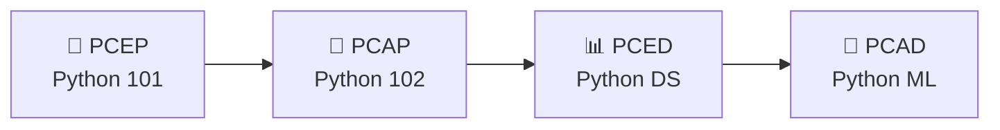

# 🐍 Python Certification Path

> **For:** Learn and Help Python DS students
> **Certifying body:** [OpenEDG Python Institute](https://pythoninstitute.org)
> **Last checked:** September 2026 — exam versions and prices change, so always confirm on the official page before you buy a voucher.

---

## 🎯 Why Get Certified?

Think of a certification like a **belt in martial arts**. You already know the moves from class — the certification is an independent test that proves it to anyone who asks: a school, a summer program, an internship, or a future employer.

- ✅ You earn a **digital badge** (via Credly) you can share and that anyone can verify.
- ✅ It gives you a **clear goal** to study toward, one step at a time.
- ✅ Each exam is **online** — you take it from home through the Python Institute's TestNow™ service.

---

## 🗺️ The Path — Four Steps

| Step | Certification | Our Course | Level | Questions | Time | Passing Score | Valid For | Exam Cost (from) |
|:---:|---|---|---|:---:|:---:|:---:|:---:|:---:|
| 1 | [PCEP™](https://pythoninstitute.org/pcep) – Certified Entry-Level Python Programmer | Python 101 | Entry | 30 | 40 min | 70% | 5 years | $69 |
| 2 | [PCAP™](https://pythoninstitute.org/pcap) – Certified Associate Python Programmer | Python 102 | Associate | 40 | 65 min | 70% | 5 years | $295 |
| 3 | [PCED™](https://pythoninstitute.org/pced) – Certified Entry-Level Data Analyst with Python | Python DS | Entry | 40 | 60 min | 75% | 7 years | $69 |
| 4 | [PCAD™](https://pythoninstitute.org/pcad) – Certified Associate Data Analyst with Python | Python ML | Associate | 48 | 60 min | 75% | 6 years | $195 |

> 💡 **None of these exams have formal prerequisites** — but each one builds on the one before it. Following the order above means you'll never walk into an exam unprepared.

---

## 🥉 Step 1 — PCEP™ (Python 101)

**Certified Entry-Level Python Programmer** · Exam code `PCEP-30-0x`

**What it proves:** You understand the core building blocks of programming in Python.

**Topics you'll see:**
- How Python runs your code (compiling vs. interpreting)
- Keywords, indentation, literals, variables, and number systems (binary, octal, hex)
- Operators and data types
- Input and output (`input()`, `print()`)
- Control flow — `if` / `elif` / `else`, `for` and `while` loops
- Collections — lists, tuples, dictionaries, strings
- Functions — built-in and your own, recursion, generators
- Exceptions — `try` / `except` and the exception hierarchy

**Free study course:** [Python Essentials 1](https://edube.org/study/pe1) (Edube)
**Syllabus:** [PCEP Exam Syllabus](https://pythoninstitute.org/pcep-exam-syllabus)
**Retake wait:** 7 days

---

## 🥈 Step 2 — PCAP™ (Python 102)

**Certified Associate Python Programmer** · Exam code `PCAP-31-0x`

**What it proves:** You can write bigger, multi-file programs and think in **objects**.

**Topics you'll see:**
- Modules, packages, and `pip`
- Character encoding and advanced string processing
- List comprehensions, lambdas, generators, iterators, and closures
- Reading and writing files
- Exception classes and hierarchies
- Selected Standard Library modules
- **Object-Oriented Programming (OOP)** — classes, objects, inheritance

**Free study course:** [Python Essentials 2](https://edube.org/study/pe2) (Edube)
**Syllabus:** [PCAP Exam Syllabus](https://pythoninstitute.org/pcap-exam-syllabus)
**Retake wait:** 15 days

> ⚠️ PCAP is the most expensive exam on this path. Take the practice test first, and consider the voucher that includes a free retake.

---

## 📊 Step 3 — PCED™ (Python DS)

**Certified Entry-Level Data Analyst with Python** · Exam code `PCED-30-0x`

**What it proves:** You can take a real dataset and turn it into answers — collecting, cleaning, analyzing, and explaining data.

**Topics you'll see:**
- Collecting, cleaning, and transforming data
- Using Python built-ins (variables, data structures, files, loops, functions) on real data
- Useful modules: `csv`, `math`, `statistics`, `datetime`, `collections`, and **NumPy**
- Basic statistics and common analysis operations
- Simple charts and **data storytelling** — explaining what you found
- **Data ethics** — using data responsibly

**Study resource:** [Python for Data Analytics 101 (PD101)](https://pythoninstitute.org/python-for-data-analytics-101)
**Syllabus:** [PCED Exam Syllabus](https://pythoninstitute.org/pced-exam-syllabus)
**Retake wait:** 7 days

> 📝 Note the **75% passing score** — a little higher than PCEP and PCAP.

---

## 🤖 Step 4 — PCAD™ (Python ML)

**Certified Associate Data Analyst with Python** · Exam code `PCAD-31-0x`

**What it proves:** You can run the **full data analysis cycle** with professional tools — from raw data all the way to a model and a clear report.

**Topics you'll see:**
- **pandas**, **NumPy**, **Matplotlib**, and **Seaborn**
- **SQL** — querying databases and connecting Python to them
- Working with data from databases, APIs, and web pages
- Descriptive and inferential statistics
- **Foundational machine learning** — regression analysis and model evaluation
- OOP and exception handling in data projects
- Communicating results to different audiences

**Free study resources (Cisco Networking Academy), in this order:**
1. [Introduction to Data Science](https://www.netacad.com/courses/introduction-data-science)
2. [Data Science Essentials with Python](https://www.netacad.com/courses/data-science-essentials-with-python)
3. [Data Analytics Essentials](https://www.netacad.com/courses/data-analytics-essentials) — modules 1, 2, 3, 5, 6, 7, 9, and 10

**Syllabus:** [PCAD Exam Syllabus](https://pythoninstitute.org/pcad-exam-syllabus)
**Retake wait:** 15 days

> 🧠 PCAD is a *data analyst* certification. It covers the ML foundations (regression, model evaluation) — our Python ML course goes further into algorithms like KNN, decision trees, and random forests. The SQL portion will need some extra practice outside class.

---

## 🧾 How to Take an Exam (All Four Work the Same Way)

1. **Talk to your parent or guardian first** — exams are paid, and you'll need their help buying a voucher.
2. Read the exam's **Testing Policies** and the [TestNow™ requirements](https://pythoninstitute.org/test-now) (webcam, quiet room, allowed materials).
3. Create a **Test Candidate account** on the Python Institute site.
4. Buy a voucher from the [OpenEDG Voucher Store](https://ums.edube.org/store). Options usually include:
   - Exam only
   - Exam + free retake
   - Exam + retake + practice test *(best value if you're nervous!)*
5. Log in, enter your voucher code, run the system check, and start your exam.
6. 🎉 **Passed?** Within 24 hours you'll get an email with your digital certificate and badge.

---

## 📚 Study Tips

- 🔁 **Finish the course first, then study the syllabus.** Go line by line through the official syllabus and check off each topic you can explain to a friend.
- 🧪 **Take the official practice test** before booking the real exam. If you score below the passing mark, you know what to review.
- ⌨️ **Type the code — don't just read it.** Many exam questions ask "What is the output of this code?" The only way to get fast at those is to run lots of small examples yourself.
- ⏱️ **Practice with a timer.** PCEP gives you about 80 seconds per question; PCAD about 75 seconds.
- 🙋 **Ask in class.** If a syllabus topic isn't clicking, bring it to class — that's what we're here for!

---

## 🔗 Quick Links

| Resource | Link |
|---|---|
| Certification Roadmap | https://pythoninstitute.org/certification-tracks |
| PCEP | https://pythoninstitute.org/pcep |
| PCAP | https://pythoninstitute.org/pcap |
| PCED | https://pythoninstitute.org/pced |
| PCAD | https://pythoninstitute.org/pcad |
| Voucher Store | https://ums.edube.org/store |
| Free courses (Edube) | https://edube.org |
| Verify a credential | https://pythoninstitute.org/credential-verification |

---

> ℹ️ **Heads-up on exam versions:** The Python Institute has announced updated versions of PCEP (`PCEP-30-03`) and PCAP (`PCAP-31-04`) scheduled for Q3 2026. The certifications themselves aren't changing — only the exam version — but check the official page to see which version is active when you register.

*Happy coding — one badge at a time! 🚀*
