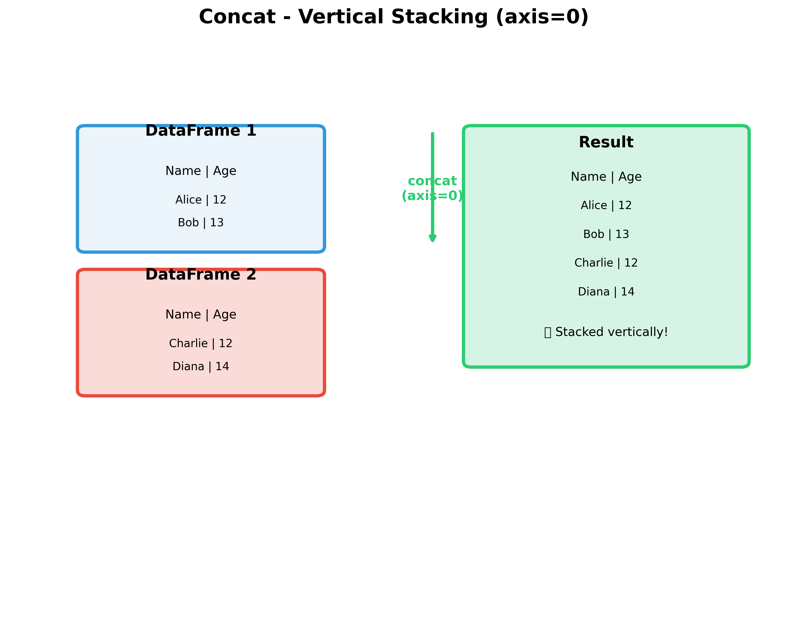
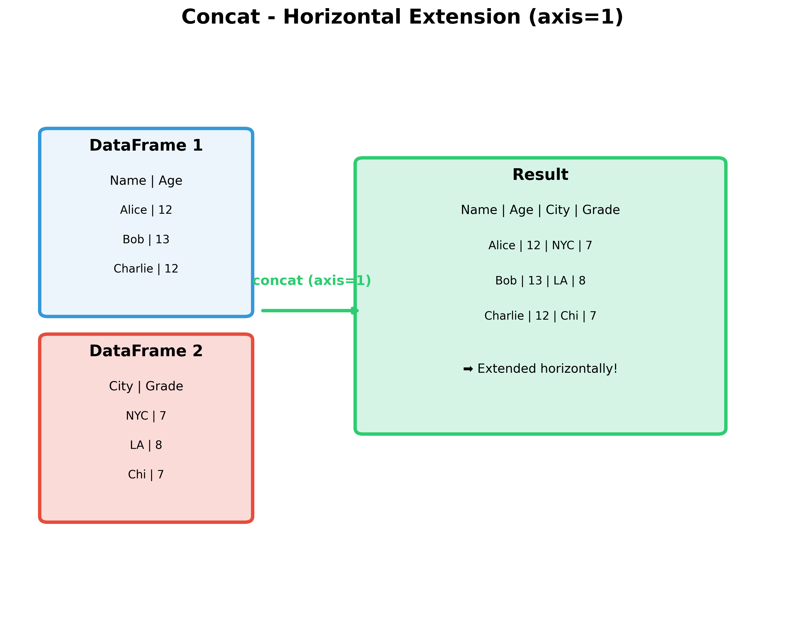
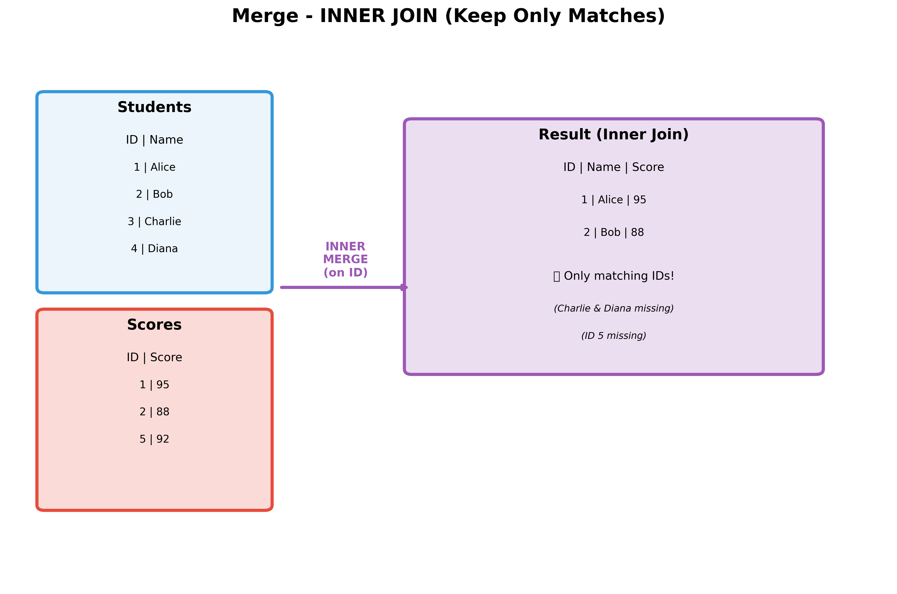
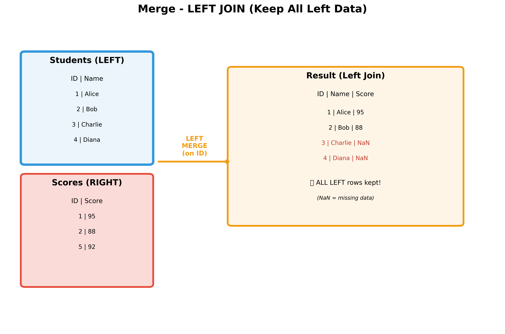
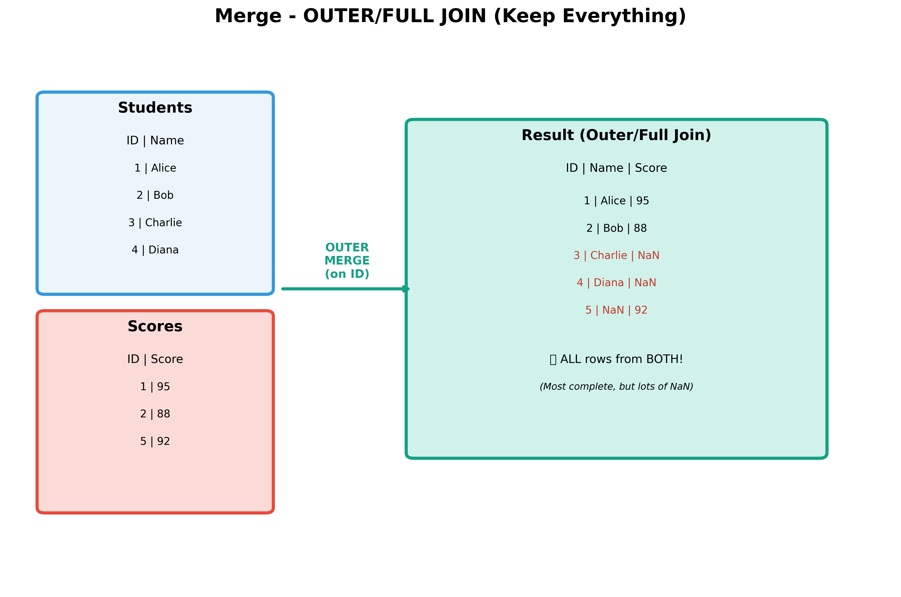
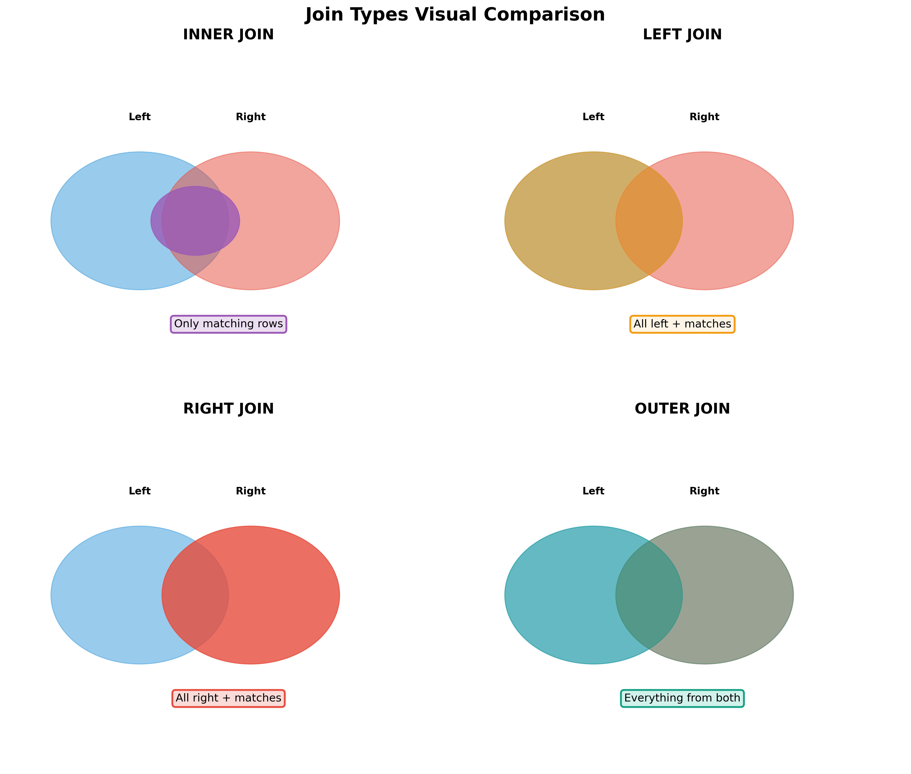

# Pandas Concat, Merge, and Join - The Complete Guide 🐼

## Welcome, Data Scientists! 👋

Have you ever tried to put together a puzzle? Or maybe combine two LEGO sets to build something amazing? That's exactly what we do with data in Pandas! We combine different pieces of data to create something more complete and useful.

Today, you'll learn three super important ways to combine DataFrames:
- **Concat** - Like stacking LEGO blocks
- **Merge** - Like matching puzzle pieces
- **Join** - A special way to merge (we'll explain!)

---

## 📚 Part 1: Understanding Concat (Concatenation)

### What is Concat?

**Concat** is short for "concatenation" which means **joining things together**. Think of it like:
- Stacking books on top of each other 📚
- Adding wagons to a train 🚂
- Taping two pieces of paper together 📄

### Two Ways to Concat

There are TWO main ways to concatenate DataFrames:

1. **Vertical Stacking (axis=0)** - Stack them on top of each other ⬆️⬇️
2. **Horizontal Extension (axis=1)** - Place them side by side ⬅️➡️

---

### 🔹 Vertical Concat (axis=0)

This is like stacking pancakes! You put one DataFrame on top of another.



**When to use it:** When you have the **same columns** but different rows of data.

**Example Scenario:** You have test scores from Monday and Tuesday, and you want to combine them into one big list!

```python
import pandas as pd

# Monday's test scores
monday_scores = pd.DataFrame({
    'Name': ['Alice', 'Bob'],
    'Score': [95, 88]
})

# Tuesday's test scores
tuesday_scores = pd.DataFrame({
    'Name': ['Charlie', 'Diana'],
    'Score': [92, 87]
})

# Stack them together!
all_scores = pd.concat([monday_scores, tuesday_scores], axis=0)
print(all_scores)
```

**Output:**
```
      Name  Score
0    Alice     95
1      Bob     88
0  Charlie     92
1    Diana     87
```

**⚠️ Notice:** The index numbers repeat (0, 1, 0, 1). To fix this:

```python
all_scores = pd.concat([monday_scores, tuesday_scores], axis=0, ignore_index=True)
print(all_scores)
```

**Better Output:**
```
      Name  Score
0    Alice     95
1      Bob     88
2  Charlie     92
3    Diana     87
```

**Pro Tip:** Use `ignore_index=True` to get clean, continuous index numbers! 🎯

---

### 🔹 Horizontal Concat (axis=1)

This is like adding pages to a notebook! You extend the DataFrame to the right.



**When to use it:** When you have **different columns** but the rows match up.

**Example Scenario:** You have names and ages in one table, and cities and grades in another. Let's combine them!

```python
# Student basic info
student_info = pd.DataFrame({
    'Name': ['Alice', 'Bob', 'Charlie'],
    'Age': [12, 13, 12]
})

# Student location and grade
student_extra = pd.DataFrame({
    'City': ['New York', 'Los Angeles', 'Chicago'],
    'Grade': [7, 8, 7]
})

# Extend horizontally!
complete_info = pd.concat([student_info, student_extra], axis=1)
print(complete_info)
```

**Output:**
```
      Name  Age         City  Grade
0    Alice   12     New York      7
1      Bob   13  Los Angeles      8
2  Charlie   12      Chicago      7
```

**🎨 Visual Memory Aid:**
- `axis=0` → Think "0 looks like a vertical line | " → Stack vertically
- `axis=1` → Think "1 looks like a horizontal line —" → Extend horizontally

---

### 🎯 Practice Exercise: Concat

**Challenge:** You run a gaming club! You have player stats from Week 1 and Week 2.

```python
week1_stats = pd.DataFrame({
    'Player': ['Sam', 'Alex'],
    'Wins': [5, 7],
    'Losses': [2, 1]
})

week2_stats = pd.DataFrame({
    'Player': ['Jordan', 'Casey'],
    'Wins': [6, 4],
    'Losses': [3, 5]
})
```

**Your Task:** Combine these into one DataFrame showing all 4 weeks! Use vertical concat!

<details>
<summary>Click to see the solution!</summary>

```python
all_weeks = pd.concat([week1_stats, week2_stats], axis=0, ignore_index=True)
print(all_weeks)
```

**Expected Output:**
```
   Player  Wins  Losses
0     Sam     5       2
1    Alex     7       1
2  Jordan     6       3
3   Casey     4       5
```
</details>

---

## 🔗 Part 2: Understanding Merge

### What is Merge?

**Merge** is like matching puzzle pieces that fit together! You combine DataFrames based on a **common column** (called a "key").

**Real-Life Analogy:** 
- You have a list of student names and their student IDs
- You have another list with student IDs and their grades
- You want to match them up to see which student got which grade!

### The Magic Key 🔑

The "key" is the column that appears in BOTH DataFrames. Pandas uses this to match rows together.

**Example:**
- DataFrame 1: Student ID and Name
- DataFrame 2: Student ID and Score
- **Key:** Student ID (it's in both!)

---

### Types of Merges (The Join Family!)

There are **4 types** of merges, and each does something different:

1. **INNER** - Keep only matching rows 🔍
2. **LEFT** - Keep all left rows, match what you can ⬅️
3. **RIGHT** - Keep all right rows, match what you can ➡️
4. **OUTER** - Keep everything from both sides 🌟

Let's explore each one!

---

### 🔍 INNER Merge (Default)

**Rule:** Keep ONLY the rows that have matching keys in BOTH DataFrames.



**When to use it:** When you only want complete information (no missing data).

**Example:**

```python
# Student names and IDs
students = pd.DataFrame({
    'ID': [1, 2, 3, 4],
    'Name': ['Alice', 'Bob', 'Charlie', 'Diana']
})

# Student scores
scores = pd.DataFrame({
    'ID': [1, 2, 5],
    'Score': [95, 88, 92]
})

# INNER merge - only keep matches!
result = pd.merge(students, scores, on='ID', how='inner')
print(result)
```

**Output:**
```
   ID   Name  Score
0   1  Alice     95
1   2    Bob     88
```

**What happened?**
- ✅ Alice (ID=1) and Bob (ID=2) are in BOTH tables → Kept!
- ❌ Charlie (ID=3) and Diana (ID=4) have no scores → Dropped!
- ❌ ID=5 has a score but no student name → Dropped!

**Key Point:** Inner merge is STRICT - if it's not in both, it's OUT! 🚫

---

### ⬅️ LEFT Merge

**Rule:** Keep ALL rows from the LEFT DataFrame, match from the right where possible.



**When to use it:** When the left DataFrame is your "main" data and you don't want to lose any of it.

**Example:**

```python
# SAME data as before
students = pd.DataFrame({
    'ID': [1, 2, 3, 4],
    'Name': ['Alice', 'Bob', 'Charlie', 'Diana']
})

scores = pd.DataFrame({
    'ID': [1, 2, 5],
    'Score': [95, 88, 92]
})

# LEFT merge - keep all students!
result = pd.merge(students, scores, on='ID', how='left')
print(result)
```

**Output:**
```
   ID     Name  Score
0   1    Alice   95.0
1   2      Bob   88.0
2   3  Charlie    NaN
3   4    Diana    NaN
```

**What happened?**
- ✅ All students are kept (left DataFrame is complete)
- ✅ Alice and Bob got their scores matched
- ⚠️ Charlie and Diana don't have scores → They get `NaN` (Not a Number = missing!)
- ❌ ID=5's score is ignored (no matching student)

**Remember:** LEFT merge is like saying "Students are important - keep them all, add scores where you can!" 📝

---

### ➡️ RIGHT Merge

**Rule:** Keep ALL rows from the RIGHT DataFrame, match from the left where possible.

**When to use it:** When the right DataFrame is your "main" data.

**Example:**

```python
# RIGHT merge - keep all scores!
result = pd.merge(students, scores, on='ID', how='right')
print(result)
```

**Output:**
```
   ID   Name  Score
0   1  Alice     95
1   2    Bob     88
2   5    NaN     92
```

**What happened?**
- ✅ All scores are kept (right DataFrame is complete)
- ✅ Scores for Alice and Bob got matched with names
- ⚠️ ID=5 has a score but no name → Gets `NaN` for Name
- ❌ Charlie and Diana are ignored (no matching scores)

**Fun Fact:** RIGHT merge is less common - most people just swap the DataFrames and use LEFT merge instead! 🔄

---

### 🌟 OUTER Merge (Full Merge)

**Rule:** Keep EVERYTHING from BOTH DataFrames. Fill missing data with NaN.



**When to use it:** When you want the complete picture, even if there's missing data.

**Example:**

```python
# OUTER merge - keep EVERYTHING!
result = pd.merge(students, scores, on='ID', how='outer')
print(result)
```

**Output:**
```
   ID     Name  Score
0   1    Alice   95.0
1   2      Bob   88.0
2   3  Charlie    NaN
3   4    Diana    NaN
4   5      NaN   92.0
```

**What happened?**
- ✅ ALL rows from both DataFrames are included!
- ⚠️ Lots of `NaN` values where data doesn't match
- This is the most complete but also the messiest!

**Use Case:** Data exploration - you want to see what data is missing! 🕵️

---

### 📊 Visual Comparison of Join Types



**Quick Reference Guide:**

| Join Type | What It Keeps | When to Use |
|-----------|---------------|-------------|
| **INNER** | Only matches | You need complete records |
| **LEFT** | All left + matches | Left table is your main data |
| **RIGHT** | All right + matches | Right table is your main data |
| **OUTER** | Everything | You want to see all data, including gaps |

---

### 🎯 Practice Exercise: Merge

**Scenario:** You're organizing a school dance! You have two lists:

```python
# Who registered for the dance
registrations = pd.DataFrame({
    'StudentID': [101, 102, 103, 104],
    'Name': ['Emma', 'Liam', 'Olivia', 'Noah']
})

# Who paid for their ticket
payments = pd.DataFrame({
    'StudentID': [101, 102, 105],
    'Amount': [15, 15, 15]
})
```

**Questions:**
1. Which students both registered AND paid? (Use what merge type?)
2. Which students registered but haven't paid yet? (Use what merge type?)
3. Is there anyone who paid but didn't register? (Use what merge type?)

<details>
<summary>Click to see the solutions!</summary>

```python
# 1. Students who registered AND paid (INNER)
both = pd.merge(registrations, payments, on='StudentID', how='inner')
print("Students who registered and paid:")
print(both)
# Output: Emma and Liam

# 2. All registered students, showing payment status (LEFT)
all_registered = pd.merge(registrations, payments, on='StudentID', how='left')
print("\nAll registered students:")
print(all_registered)
# Olivia and Noah will have NaN for Amount - they haven't paid!

# 3. Check if anyone paid without registering (RIGHT)
all_payments = pd.merge(registrations, payments, on='StudentID', how='right')
print("\nAll payments:")
print(all_payments)
# StudentID 105 has Amount but NaN for Name - paid but not registered!
```
</details>

---

## 🤝 Part 3: Understanding Join

### What is Join?

**Join** is a special type of merge that uses the **index** instead of a column to match DataFrames.

**Key Difference:**
- **Merge:** Matches using a column (like 'ID' or 'Name')
- **Join:** Matches using the index (the numbers on the left: 0, 1, 2, 3...)

### When to Use Join vs Merge

**Use Merge when:**
- You have a specific column to match on (like Student ID, Product Code, etc.)
- Your data has meaningful column names for matching

**Use Join when:**
- The index is what you want to match on
- You're combining DataFrames that were split apart earlier
- You want a quick shortcut (join has simpler syntax!)

---

### Join Syntax

```python
# Basic join syntax
result = df1.join(df2, how='left')
```

**Join types are the same as merge:**
- `how='inner'` - Only keep matching indices
- `how='left'` - Keep all left indices (default!)
- `how='right'` - Keep all right indices
- `how='outer'` - Keep all indices

---

### Join Example

```python
# Create DataFrames with meaningful indices
students = pd.DataFrame({
    'Name': ['Alice', 'Bob', 'Charlie']
}, index=[101, 102, 103])

grades = pd.DataFrame({
    'Math': [95, 88, 92],
    'Science': [90, 85, 94]
}, index=[101, 102, 104])

# Join them using the index!
result = students.join(grades, how='left')
print(result)
```

**Output:**
```
        Name  Math  Science
101    Alice  95.0     90.0
102      Bob  88.0     85.0
103  Charlie   NaN      NaN
```

**Notice:** Charlie (index 103) doesn't have grades, so they get NaN. Index 104's grades are ignored because there's no matching student.

---

### 🔄 Merge vs Join: Side by Side

**Same result, different syntax:**

```python
# Using MERGE (on a column)
result = pd.merge(df1, df2, left_on='StudentID', right_on='StudentID', how='left')

# Using JOIN (on the index)
# First, set StudentID as index
df1_indexed = df1.set_index('StudentID')
df2_indexed = df2.set_index('StudentID')
result = df1_indexed.join(df2_indexed, how='left')
```

**Pro Tip:** Most data scientists use **merge** more often because it's more flexible and explicit! 🎓

---

## 🧠 Part 4: Quick Reference & Memory Tricks

### The Decision Tree 🌳

```
Need to combine DataFrames?
│
├─ Are the rows DIFFERENT but columns SAME?
│  └─ Use CONCAT with axis=0 (vertical stack)
│
├─ Are the columns DIFFERENT but rows ALIGNED?
│  └─ Use CONCAT with axis=1 (horizontal extend)
│
└─ Need to MATCH rows using a common column/index?
   │
   ├─ Using a COLUMN to match?
   │  └─ Use MERGE with 'on' parameter
   │
   └─ Using the INDEX to match?
      └─ Use JOIN
```

---

### Memory Tricks 🧠

**For Concat:**
- **Axis=0:** Zero looks like **O** → **O**verhead (vertical, on top)
- **Axis=1:** One looks like **—** (horizontal line)

**For Merge Types:**
- **INNER:** Think "**IN**tersection" - only what's **IN** both
- **LEFT:** **L**eft is **L**oyal - keeps all **L**eft data
- **RIGHT:** Like LEFT but reversed
- **OUTER:** Think "**OUT** to space" - includes everything!

**For Join:**
- Join = "**J**ust use the **I**ndex" 😄

---

## 🎮 Part 5: Real-World Applications

### Example 1: Video Game Inventory

You're building a game inventory system!

```python
# Player inventory (what items they have)
inventory = pd.DataFrame({
    'ItemID': [1, 2, 3, 4],
    'Quantity': [5, 2, 1, 10]
})

# Item details (what each item is)
items = pd.DataFrame({
    'ItemID': [1, 2, 3, 5],
    'ItemName': ['Health Potion', 'Sword', 'Shield', 'Magic Ring'],
    'Value': [10, 50, 40, 100]
})

# Merge to see what the player has with full details!
player_items = pd.merge(inventory, items, on='ItemID', how='left')
print(player_items)
```

---

### Example 2: School Gradebook

Combining different assignment types:

```python
# Homework scores
homework = pd.DataFrame({
    'Student': ['Alice', 'Bob', 'Charlie'],
    'HW_Score': [95, 88, 92]
})

# Test scores
tests = pd.DataFrame({
    'Student': ['Alice', 'Bob', 'Diana'],
    'Test_Score': [90, 85, 94]
})

# Combine with OUTER to see who's missing what
all_grades = pd.merge(homework, tests, on='Student', how='outer')
print(all_grades)
```

---

### Example 3: Sports Team Stats

Combining multiple seasons:

```python
# Season 1 stats
season1 = pd.DataFrame({
    'Player': ['Sam', 'Alex'],
    'Points': [150, 200]
})

# Season 2 stats  
season2 = pd.DataFrame({
    'Player': ['Sam', 'Alex'],
    'Points': [180, 190]
})

# Concat to see progression over time
all_seasons = pd.concat([season1, season2], 
                        keys=['Season1', 'Season2'],
                        names=['Season', 'Game'])
print(all_seasons)
```

---

## ✅ Part 6: Common Mistakes & How to Fix Them

### Mistake 1: Wrong Axis in Concat

```python
# ❌ WRONG - trying to stack different columns vertically
df1 = pd.DataFrame({'A': [1, 2]})
df2 = pd.DataFrame({'B': [3, 4]})
result = pd.concat([df1, df2], axis=0)  # Creates NaN!

# ✅ CORRECT - use axis=1 for different columns
result = pd.concat([df1, df2], axis=1)
```

---

### Mistake 2: Forgetting ignore_index

```python
# ❌ WRONG - duplicate indices
result = pd.concat([df1, df2], axis=0)
# Index: 0, 1, 0, 1 (confusing!)

# ✅ CORRECT - reset index
result = pd.concat([df1, df2], axis=0, ignore_index=True)
# Index: 0, 1, 2, 3 (clean!)
```

---

### Mistake 3: Using Wrong Join Type

```python
# You want to keep all students even if they don't have scores

# ❌ WRONG - loses students without scores
result = pd.merge(students, scores, on='ID', how='inner')

# ✅ CORRECT - keeps all students
result = pd.merge(students, scores, on='ID', how='left')
```

---

### Mistake 4: Key Column Doesn't Match

```python
# ❌ WRONG - column names don't match!
df1 = pd.DataFrame({'ID': [1, 2], 'Name': ['Alice', 'Bob']})
df2 = pd.DataFrame({'StudentID': [1, 2], 'Score': [95, 88]})
result = pd.merge(df1, df2, on='ID')  # ERROR!

# ✅ CORRECT - specify both column names
result = pd.merge(df1, df2, left_on='ID', right_on='StudentID')
```

---

## 🏆 Part 7: Challenge Projects

### Project 1: Movie Database

Create a movie database system that combines:
- Movie titles and release years
- Director information
- Box office earnings
- Ratings from critics

**Your Task:** Use merge to create a complete movie report!

---

### Project 2: Fantasy Sports League

You're managing a fantasy sports league:
- Player stats from different weeks (concat)
- Player information and team assignments (merge)
- Calculate total points per team

---

### Project 3: Online Store

Build a simple order management system:
- Product catalog (ID, Name, Price)
- Customer orders (CustomerID, ProductID, Quantity)
- Customer information (CustomerID, Name, Email)

**Challenge:** Create a complete order report showing customer names, products ordered, and total prices!

---

## 📚 Part 8: Summary Cheat Sheet

### Concat Quick Reference

```python
# Vertical stack (more rows)
pd.concat([df1, df2], axis=0, ignore_index=True)

# Horizontal extend (more columns)
pd.concat([df1, df2], axis=1)
```

### Merge Quick Reference

```python
# Inner (only matches)
pd.merge(df1, df2, on='key', how='inner')

# Left (all left rows)
pd.merge(df1, df2, on='key', how='left')

# Right (all right rows)
pd.merge(df1, df2, on='key', how='right')

# Outer (all rows from both)
pd.merge(df1, df2, on='key', how='outer')

# Different column names
pd.merge(df1, df2, left_on='col1', right_on='col2')
```

### Join Quick Reference

```python
# Left join (default)
df1.join(df2)

# Specify join type
df1.join(df2, how='inner')
```

---

## 🎯 Final Tips for Success

1. **Start Simple:** Test with small DataFrames first (3-4 rows)
2. **Print Often:** Always print results to verify they match expectations
3. **Check Shapes:** Use `df.shape` to see if row/column counts make sense
4. **Look for NaN:** Missing data (NaN) tells you what didn't match
5. **Use .head():** For large DataFrames, use `result.head()` to see first few rows
6. **Visualize:** Draw it out on paper before coding!

---

## 🎓 What You've Learned

Congratulations! You now know:

✅ How to **concat** DataFrames vertically (axis=0) and horizontally (axis=1)  
✅ The four types of **merge**: inner, left, right, and outer  
✅ When to use each merge type based on your needs  
✅ How **join** works with indices  
✅ Real-world applications of combining data  
✅ Common mistakes and how to avoid them

---

## 🚀 Next Steps

Ready for more? Try these:
- Explore `pd.concat()` with more than 2 DataFrames
- Learn about multi-index merging
- Study the `suffixes` parameter in merge
- Practice with real datasets from Kaggle

---

## 💡 Remember

> "Data is like LEGO blocks - the magic happens when you put them together in creative ways!"

Keep practicing, stay curious, and happy coding! 🎉

---

**Created for Python Data Science Students**  
*Version 1.0 - Tailored for Middle School Learners*

---

## Additional Resources

### Practice Datasets

Here's a simple dataset to practice with:

```python
# Create practice data
import pandas as pd

# Students
students = pd.DataFrame({
    'StudentID': [1, 2, 3, 4, 5],
    'Name': ['Alice', 'Bob', 'Charlie', 'Diana', 'Eve'],
    'Grade': [7, 8, 7, 8, 7]
})

# Math scores
math_scores = pd.DataFrame({
    'StudentID': [1, 2, 3, 6],
    'Math': [95, 88, 92, 85]
})

# Science scores
science_scores = pd.DataFrame({
    'StudentID': [1, 2, 4, 5],
    'Science': [90, 85, 88, 94]
})

# Practice merging these in different ways!
```

---

### Helpful Functions

```python
# Check for missing data
df.isnull().sum()

# See DataFrame info
df.info()

# Get basic statistics
df.describe()

# Reset index
df.reset_index(drop=True)

# Set a column as index
df.set_index('ColumnName')
```

---

Happy Data Combining! 🐼✨
