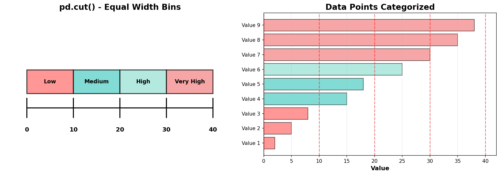
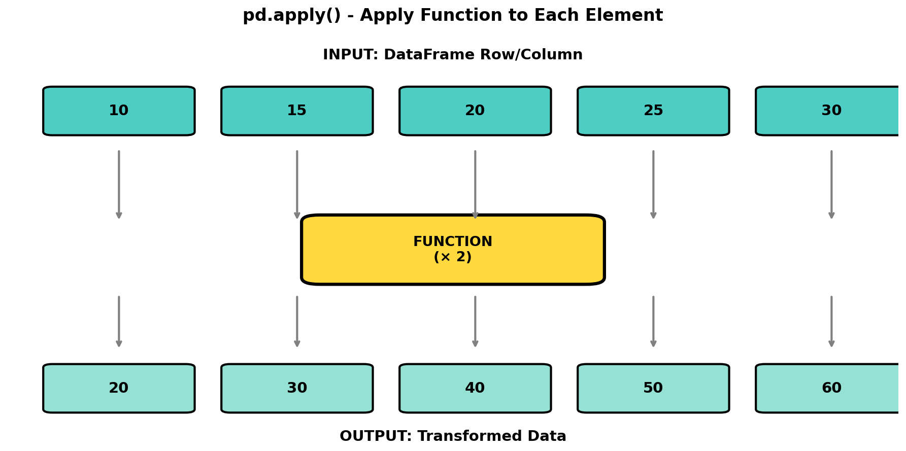
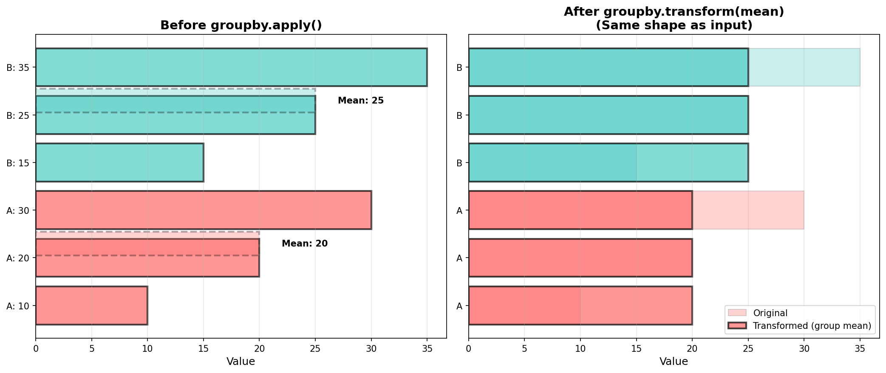
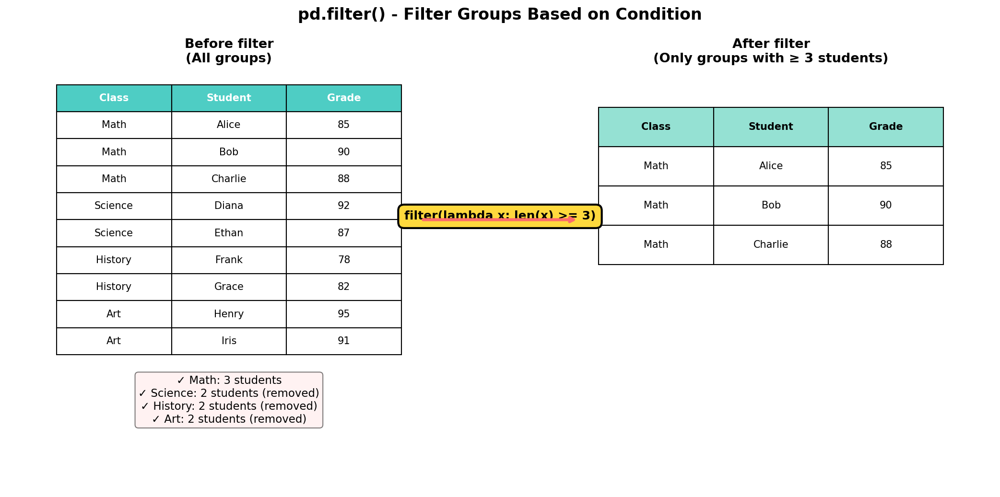
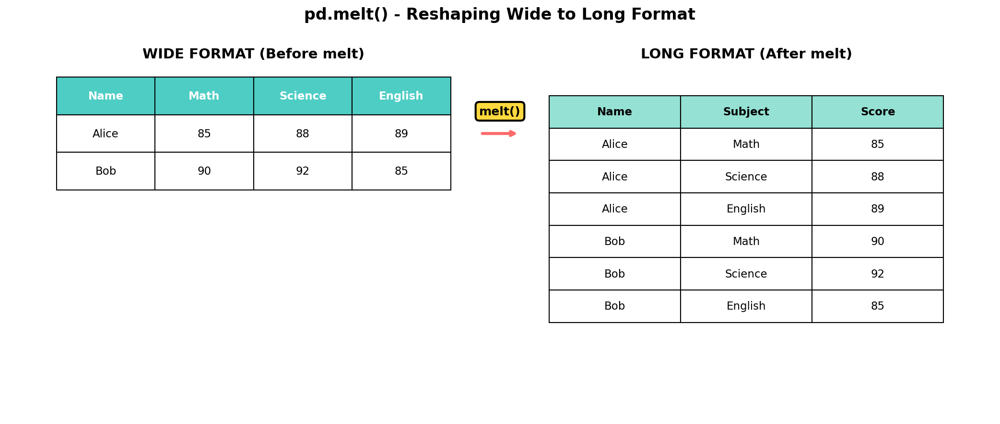
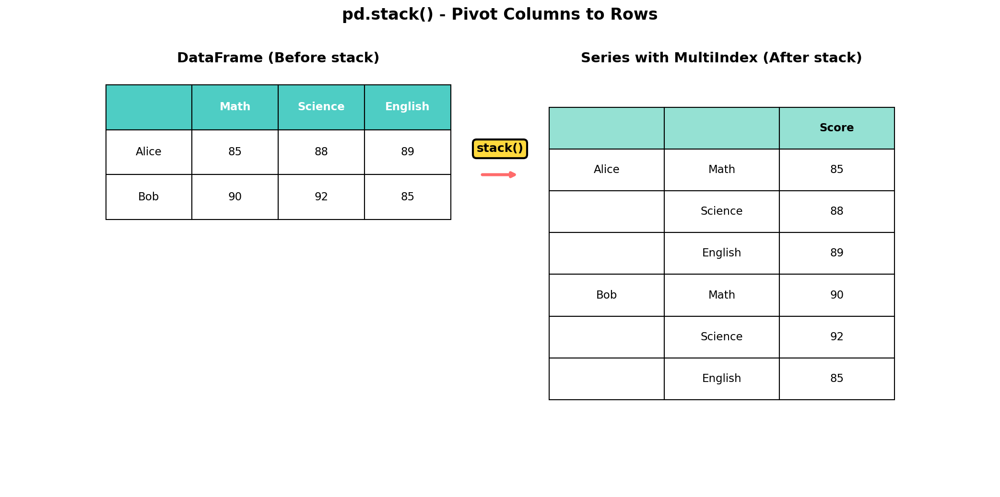
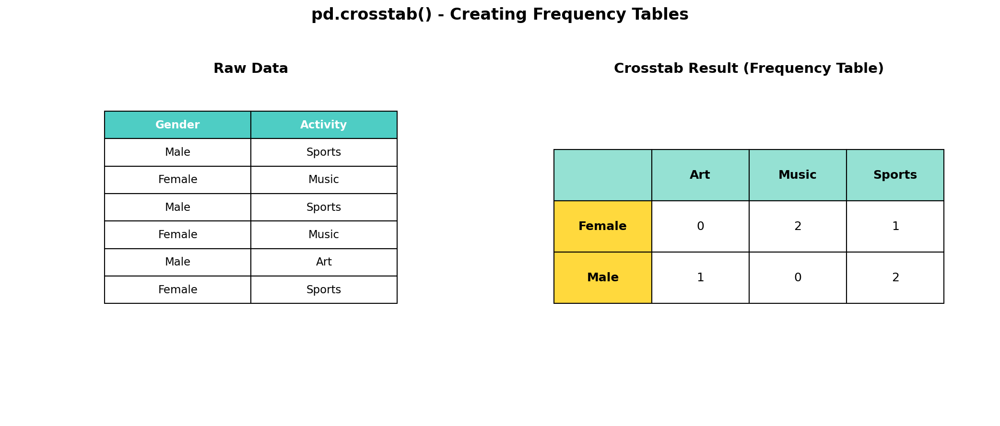

# 🐼 Pandas Advanced Techniques: Complete Guide

**Instructor:** Siva R Jasthi | Metropolitan State University  
**Course:** Python for Data Science  
**Level:** Middle School & High School

---

## 📚 Table of Contents

1. [pd.cut() - Binning with Equal Width](#1-pdcut---binning-with-equal-width)
2. [pd.qcut() - Binning with Equal Counts](#2-pdqcut---binning-with-equal-counts)
3. [apply() - Custom Functions](#3-apply---custom-functions)
4. [transform() - Transform While Keeping Shape](#4-transform---transform-while-keeping-shape)
5. [filter() - Filter Groups](#5-filter---filter-groups)
6. [melt() - Reshape Wide to Long](#6-melt---reshape-wide-to-long)
7. [stack() - Pivot Columns to Rows](#7-stack---pivot-columns-to-rows)
8. [crosstab() - Frequency Tables](#8-crosstab---frequency-tables)
9. [Quick Reference Cheat Sheet](#quick-reference-cheat-sheet)

---

# 1. pd.cut() - Binning with Equal Width

## 🤔 What is `pd.cut()`?

**pd.cut()** divides continuous data into discrete bins (categories) with **equal width**. Think of it like sorting laundry into temperature bins: cold (0-30°), warm (31-60°), and hot (61-90°).

### Key Concept
- Creates bins with **equal ranges** (width)
- Bins may have **different counts** of data points
- Used when you have **specific ranges** in mind



## 📖 Real-World Examples

- **Letter Grades:** 90-100 = A, 80-89 = B, 70-79 = C, etc.
- **Age Groups:** 0-12 = Child, 13-19 = Teen, 20-64 = Adult, 65+ = Senior
- **Price Ranges:** $0-100 = Budget, $100-500 = Mid-range, $500+ = Premium
- **Temperature Zones:** Cold, Cool, Warm, Hot

## 💻 Basic Syntax

```python
pd.cut(
    data,                    # Array or Series to bin
    bins,                    # Number of bins OR list of bin edges
    labels=None,             # Names for the bins
    include_lowest=False,    # Include the lowest edge?
    right=True              # Right edge inclusive?
)
```

## 📝 Example 1: Converting Test Scores to Letter Grades

```python
import pandas as pd

# Student test scores
scores = [95, 87, 76, 92, 65, 88, 58, 73, 91, 82]
students = ['Alice', 'Bob', 'Charlie', 'Diana', 'Ethan', 
            'Fiona', 'George', 'Hannah', 'Ian', 'Julia']

df = pd.DataFrame({'Student': students, 'Score': scores})

# Define grade bins
bins = [0, 60, 70, 80, 90, 100]
labels = ['F', 'D', 'C', 'B', 'A']

# Apply pd.cut
df['Letter_Grade'] = pd.cut(df['Score'], 
                             bins=bins, 
                             labels=labels,
                             include_lowest=True)

print(df)
```

**Output:**
```
   Student  Score Letter_Grade
0    Alice     95            A
1      Bob     87            B
2  Charlie     76            C
3    Diana     92            A
4    Ethan     65            D
...
```

## 📝 Example 2: Age Groups

```python
ages = [5, 12, 8, 15, 18, 22, 7, 14, 10, 19]
df_ages = pd.DataFrame({'Age': ages})

# Create age groups
bins = [0, 10, 13, 18, 25]
labels = ['Kids (5-10)', 'Tweens (11-13)', 'Teens (14-18)', 'Young Adults (19-25)']

df_ages['Age_Group'] = pd.cut(df_ages['Age'], bins=bins, labels=labels)
print(df_ages)
```

## ⚠️ Common Mistakes

### ❌ Wrong: Number of labels doesn't match bins

```python
bins = [0, 10, 20, 30, 40]      # 5 edges = 4 bins
labels = ['A', 'B', 'C', 'D', 'E']  # 5 labels - ERROR!
```

### ✅ Correct: One less label than bin edges

```python
bins = [0, 10, 20, 30, 40]      # 5 edges = 4 bins
labels = ['A', 'B', 'C', 'D']       # 4 labels - CORRECT!
```

## 💡 Key Points

- **Equal width bins:** Each range spans the same distance
- **Unequal counts:** Some bins may have more data than others
- **Bin edges:** N edges create N-1 bins
- **include_lowest=True:** Include the minimum value

---

# 2. pd.qcut() - Binning with Equal Counts

## 🤔 What is `pd.qcut()`?

**pd.qcut()** divides data into bins with **equal counts** (quantiles). Think of it like dividing a pizza into equal slices - each slice has the same amount!

### Key Concept
- Creates bins with **equal counts** of data points
- Bins may have **different widths** (ranges)
- Used for **percentile-based** grouping


## 📊 pd.cut() vs pd.qcut()

| Feature | pd.cut() | pd.qcut() |
|---------|----------|-----------|
| **Bin Width** | Equal | Variable |
| **Bin Count** | Variable | Equal (or as close as possible) |
| **Use When** | Fixed ranges matter | Equal distribution matters |
| **Example** | Letter grades (A=90-100) | Top 25%, next 25%, etc. |

## 💻 Basic Syntax

```python
pd.qcut(
    data,           # Array or Series to bin
    q,              # Number of quantiles
    labels=None,    # Names for the bins
    duplicates='raise'  # How to handle duplicate edges
)
```

## 📝 Example 1: Student Rankings by Quartiles

```python
import pandas as pd
import numpy as np

# Test scores
np.random.seed(42)
scores = np.random.randint(60, 100, size=20)
students = [f"Student_{i+1}" for i in range(20)]

df = pd.DataFrame({'Student': students, 'Score': scores})

# Divide into quartiles (4 equal groups)
df['Quartile'] = pd.qcut(df['Score'], 
                          q=4, 
                          labels=['Q4 (Bottom)', 'Q3', 'Q2', 'Q1 (Top)'])

# Count students per quartile
print(df['Quartile'].value_counts())
```

**Output:**
```
Q4 (Bottom)    5
Q3             5
Q2             5
Q1 (Top)       5
```

**Notice:** Each quartile has exactly 5 students (20 ÷ 4 = 5)!

## 📝 Example 2: Game Leaderboard Tiers

```python
# Player scores
game_scores = [1000, 2500, 3200, 4500, 5000, 6200, 7500, 8000, 
               8500, 9000, 9500, 10000, 11000, 12000, 13000, 15000]

df_game = pd.DataFrame({'Points': game_scores})

# Divide into tiers
df_game['Tier'] = pd.qcut(df_game['Points'], 
                          q=4, 
                          labels=['🥉 Bronze', '🥈 Silver', '🥇 Gold', '💎 Platinum'])

print(df_game)
```

## 📝 Example 3: Income Brackets

```python
# Annual incomes
incomes = [25000, 30000, 35000, 40000, 45000, 50000, 55000, 60000,
           65000, 70000, 80000, 90000, 100000, 120000, 150000, 200000]

df_income = pd.DataFrame({'Income': incomes})

# Divide into 5 quintiles
df_income['Bracket'] = pd.qcut(df_income['Income'], 
                                q=5, 
                                labels=['Bottom 20%', 'Second 20%', 'Middle 20%', 
                                       'Fourth 20%', 'Top 20%'])
```

## 🎯 When to Use Which?

### Use `pd.cut()` when:
- ✅ You have **specific cutoff values** (e.g., grade boundaries)
- ✅ Categories have **meaningful ranges** (e.g., age groups)
- ✅ **Equal width** is important

### Use `pd.qcut()` when:
- ✅ You want **equal-sized groups** (e.g., top 10%, next 10%)
- ✅ Creating **rankings** or **tiers**
- ✅ **Percentile analysis** is needed

---

# 3. apply() - Custom Functions

## 🤔 What is `apply()`?

**apply()** applies a function to each row or column of a DataFrame. Think of it like a factory assembly line - each item goes through the same process!



## 💻 Basic Syntax

```python
# Apply to Series (column)
series.apply(function)

# Apply to DataFrame
df.apply(function, axis=0)  # Apply to each column (default)
df.apply(function, axis=1)  # Apply to each row
```

## 🔄 Understanding axis Parameter

```
DataFrame:
        A    B    C
    0  10   20   30
    1  40   50   60

axis=0 (columns, default):
    ↓    ↓    ↓
   [10] [20] [30]
   [40] [50] [60]
   
axis=1 (rows):
   [10, 20, 30] →
   [40, 50, 60] →
```

## 📝 Example 1: Weighted Grade Calculator

```python
import pandas as pd

# Student grades
df = pd.DataFrame({
    'Name': ['Alice', 'Bob', 'Charlie', 'Diana', 'Ethan'],
    'Homework': [85, 92, 78, 95, 88],
    'Midterm': [88, 85, 90, 92, 86],
    'Final': [90, 88, 85, 94, 91]
})

# Define weighted average function
def calculate_final_grade(row):
    """
    Homework: 30%
    Midterm: 30%
    Final: 40%
    """
    return round(row['Homework'] * 0.30 + 
                 row['Midterm'] * 0.30 + 
                 row['Final'] * 0.40, 2)

# Apply to each row (axis=1)
df['Final_Grade'] = df.apply(calculate_final_grade, axis=1)

print(df)
```

**Output:**
```
      Name  Homework  Midterm  Final  Final_Grade
0    Alice        85       88     90        88.10
1      Bob        92       85     88        88.20
2  Charlie        78       90     85        85.10
...
```

## 📝 Example 2: Temperature Converter

```python
# Temperatures in Fahrenheit
df_temps = pd.DataFrame({
    'City': ['New York', 'Los Angeles', 'Chicago', 'Houston', 'Phoenix'],
    'Temp_F': [75, 82, 68, 88, 95]
})

# Conversion function
def fahrenheit_to_celsius(temp_f):
    """Convert °F to °C"""
    return round((temp_f - 32) * 5/9, 1)

# Apply to column
df_temps['Temp_C'] = df_temps['Temp_F'].apply(fahrenheit_to_celsius)

print(df_temps)
```

## 📝 Example 3: Conditional Logic with apply

```python
# Employee bonus calculator
employees = pd.DataFrame({
    'Name': ['Alice', 'Bob', 'Charlie', 'Diana'],
    'Salary': [50000, 60000, 45000, 70000],
    'Performance_Score': [92, 78, 88, 95]
})

def calculate_bonus(row):
    """
    Bonus rules:
    - Score >= 90: 10% bonus
    - Score >= 80: 5% bonus
    - Score < 80: 2% bonus
    """
    score = row['Performance_Score']
    salary = row['Salary']
    
    if score >= 90:
        return salary * 0.10
    elif score >= 80:
        return salary * 0.05
    else:
        return salary * 0.02

employees['Bonus'] = employees.apply(calculate_bonus, axis=1)
employees['Total'] = employees['Salary'] + employees['Bonus']

print(employees)
```

## 💡 Lambda Functions with apply

```python
# Quick one-liner transformations
df['doubled'] = df['value'].apply(lambda x: x * 2)
df['category'] = df['score'].apply(lambda x: 'Pass' if x >= 70 else 'Fail')
```

---

# 4. transform() - Transform While Keeping Shape

## 🤔 What is `transform()`?

**transform()** applies a function to groups but **always returns the same shape** as the input. Think of it like photo filters - the photo stays the same size, only the values change!



## 📊 apply() vs transform()

| Feature | apply() | transform() |
|---------|---------|-------------|
| **Output Shape** | Can vary | Always same as input |
| **Use Case** | Aggregations, any function | Group-wise transformations |
| **Returns** | Series, DataFrame, or scalar | Same shape as input |

## 💻 Basic Syntax

```python
# On Series
series.transform(function)

# On GroupBy object
df.groupby('column').transform(function)
```

## 📝 Example 1: Normalize Scores by Class

```python
import pandas as pd

# Student scores from different classes
students = pd.DataFrame({
    'Name': ['Alice', 'Bob', 'Charlie', 'Diana', 'Ethan', 'Fiona'],
    'Class': ['A', 'A', 'A', 'B', 'B', 'B'],
    'Score': [85, 90, 78, 70, 88, 92]
})

# Calculate each score as % of class average
def normalize_to_average(group):
    """Express each score as percentage of group average"""
    avg = group.mean()
    return (group / avg) * 100

students['Normalized'] = students.groupby('Class')['Score'].transform(normalize_to_average)
students['Normalized'] = students['Normalized'].round(1)

print(students)
```

**Output:**
```
     Name Class  Score  Normalized
0   Alice     A     85        100.5
1     Bob     A     90        106.3
2 Charlie     A     78         92.2
3   Diana     B     70         84.0
4   Ethan     B     88        105.6
5   Fiona     B     92        110.4
```

**Notice:** Each row gets a value - same shape as input!

## 📝 Example 2: Add Group Statistics

```python
# Sales data by region
sales = pd.DataFrame({
    'Region': ['North', 'North', 'South', 'South', 'East', 'East'],
    'Store': ['A', 'B', 'A', 'B', 'A', 'B'],
    'Sales': [5000, 7000, 6000, 8000, 5500, 6500]
})

# Add region total to each row
sales['Region_Total'] = sales.groupby('Region')['Sales'].transform('sum')

# Calculate percentage
sales['Pct_of_Region'] = (sales['Sales'] / sales['Region_Total'] * 100).round(1)

print(sales)
```

**Output:**
```
  Region Store  Sales  Region_Total  Pct_of_Region
0  North     A   5000         12000           41.7
1  North     B   7000         12000           58.3
2  South     A   6000         14000           42.9
3  South     B   8000         14000           57.1
...
```

## 📝 Example 3: Z-Score Standardization

```python
# Standardize scores within each group
def z_score(group):
    """Convert to z-scores (mean=0, std=1)"""
    return (group - group.mean()) / group.std()

students['Z_Score'] = students.groupby('Class')['Score'].transform(z_score)
```

## 💡 Common transform() Functions

```python
# Built-in aggregations
df.groupby('group')['value'].transform('sum')      # Group sum
df.groupby('group')['value'].transform('mean')     # Group mean
df.groupby('group')['value'].transform('max')      # Group max
df.groupby('group')['value'].transform('count')    # Group count

# Custom functions
df.groupby('group')['value'].transform(lambda x: x - x.mean())  # Deviation from mean
df.groupby('group')['value'].transform(lambda x: x / x.sum())   # Percentage of total
```

---

# 5. filter() - Filter Groups

## 🤔 What is `filter()`?

**filter()** keeps or removes **entire groups** based on a condition. Think of it like a bouncer at a club - groups that meet requirements get in, others don't!



## 💻 Basic Syntax

```python
df.groupby('column').filter(function)
```

The function should return `True` (keep group) or `False` (remove group).

## 📝 Example 1: Keep Only Large Classes

```python
import pandas as pd

# Student enrollment data
enrollment = pd.DataFrame({
    'Student': ['A', 'B', 'C', 'D', 'E', 'F', 'G', 'H'],
    'Class': ['Math', 'Math', 'Science', 'Science', 'History', 
              'Math', 'Art', 'Art'],
    'Grade': [85, 90, 78, 92, 88, 95, 82, 79]
})

print("Original data:")
print(enrollment)

# Keep only classes with at least 3 students
large_classes = enrollment.groupby('Class').filter(lambda x: len(x) >= 3)

print("\nAfter filtering (≥ 3 students):")
print(large_classes)
```

**Output:**
```
Original data:
  Student    Class  Grade
0       A     Math     85
1       B     Math     90
2       C  Science     78
3       D  Science     92
4       E  History     88
5       F     Math     95
6       G      Art     82
7       H      Art     79

After filtering (≥ 3 students):
  Student  Class  Grade
0       A   Math     85
1       B   Math     90
5       F   Math     95
```

**Notice:** Entire groups are kept or removed!
- Math: 3 students → KEPT ✓
- Science: 2 students → REMOVED ✗
- History: 1 student → REMOVED ✗
- Art: 2 students → REMOVED ✗

## 📝 Example 2: Filter by Group Statistics

```python
# Sales data
sales = pd.DataFrame({
    'Region': ['North', 'North', 'South', 'South', 'East', 'East', 
               'West', 'West'],
    'Month': ['Jan', 'Feb', 'Jan', 'Feb', 'Jan', 'Feb', 'Jan', 'Feb'],
    'Sales': [5000, 7000, 2000, 2500, 6000, 8000, 3000, 3500]
})

# Keep only regions with total sales > $10,000
high_sales_regions = sales.groupby('Region').filter(lambda x: x['Sales'].sum() > 10000)

print(high_sales_regions)
```

## 📝 Example 3: Filter by Multiple Conditions

```python
# Keep groups with:
# - At least 3 members
# - Average score > 80

result = df.groupby('Class').filter(
    lambda x: len(x) >= 3 and x['Score'].mean() > 80
)
```

## 💡 Key Differences

```python
# WHERE vs FILTER

# WHERE: Filters individual rows
df[df['Score'] > 80]  # Keeps individual rows

# FILTER: Filters entire groups
df.groupby('Class').filter(lambda x: x['Score'].mean() > 80)  # Keeps entire classes
```

---

# 6. melt() - Reshape Wide to Long

## 🤔 What is `melt()`?

**melt()** transforms data from wide format (many columns) to long format (many rows). Think of it like unpacking a spreadsheet!



## 📊 Wide vs Long Format

**Wide Format:**
- Each variable has its own column
- Good for human reading
- Excel-style layout

**Long Format:**
- Variables stacked into rows
- Better for analysis and plotting
- Database-style layout

## 💻 Basic Syntax

```python
pd.melt(
    df,
    id_vars=None,        # Columns to keep as identifiers
    value_vars=None,     # Columns to melt (default: all not in id_vars)
    var_name='variable', # Name for the variable column
    value_name='value'   # Name for the value column
)
```

## 📝 Example 1: Student Grades

```python
import pandas as pd

# Wide format: Each subject is a column
grades_wide = pd.DataFrame({
    'Name': ['Alice', 'Bob', 'Charlie'],
    'Math': [85, 90, 78],
    'Science': [88, 92, 82],
    'English': [89, 85, 88]
})

print("WIDE FORMAT:")
print(grades_wide)

# Melt to long format
grades_long = pd.melt(
    grades_wide,
    id_vars=['Name'],      # Keep Name column
    var_name='Subject',    # Column names become 'Subject'
    value_name='Score'     # Values become 'Score'
)

print("\nLONG FORMAT:")
print(grades_long)
```

**Output:**
```
WIDE FORMAT:
      Name  Math  Science  English
0    Alice    85       88       89
1      Bob    90       92       85
2  Charlie    78       82       88

LONG FORMAT:
      Name  Subject  Score
0    Alice     Math     85
1      Bob     Math     90
2  Charlie     Math     78
3    Alice  Science     88
4      Bob  Science     92
5  Charlie  Science     82
6    Alice  English     89
7      Bob  English     85
8  Charlie  English     88
```

## 📝 Example 2: Monthly Sales

```python
# Wide format: Each month is a column
sales_wide = pd.DataFrame({
    'Product': ['Widget', 'Gadget', 'Gizmo'],
    'Jan': [100, 150, 120],
    'Feb': [120, 160, 110],
    'Mar': [110, 170, 130]
})

# Melt to long format
sales_long = pd.melt(
    sales_wide,
    id_vars=['Product'],
    var_name='Month',
    value_name='Sales'
)

print(sales_long)

# Now easy to analyze
print("\nTotal sales by month:")
print(sales_long.groupby('Month')['Sales'].sum())
```

## 📝 Example 3: Selective Melting

```python
# Melt only specific columns
df = pd.DataFrame({
    'Name': ['Alice', 'Bob'],
    'Age': [25, 30],
    'Test1': [85, 90],
    'Test2': [88, 92],
    'Test3': [89, 91]
})

# Melt only test scores, keep Age
result = pd.melt(
    df,
    id_vars=['Name', 'Age'],           # Keep both
    value_vars=['Test1', 'Test2', 'Test3'],  # Melt only these
    var_name='Test',
    value_name='Score'
)
```

## 💡 Why Use melt()?

✅ **Better for analysis:** Easier to group and aggregate  
✅ **Better for plotting:** Most plotting libraries prefer long format  
✅ **Database-friendly:** Matches relational database structure  
✅ **More flexible:** Easier to filter and query

---

# 7. stack() - Pivot Columns to Rows

## 🤔 What is `stack()`?

**stack()** pivots column labels into the row index, creating a **multi-level index**. Think of it like stacking pancakes - taking things that are side-by-side and putting them on top of each other!



## 📊 melt() vs stack()

| Feature | melt() | stack() |
|---------|--------|---------|
| **Output** | Regular DataFrame | Series with MultiIndex |
| **Index** | Resets to numbers | Creates hierarchical index |
| **Use Case** | General reshaping | Pivot operations |

## 💻 Basic Syntax

```python
df.stack()    # Stack all columns
df.stack(level=-1)  # Stack specific level
```

## 📝 Example 1: Basic Stacking

```python
import pandas as pd

# Create DataFrame
df = pd.DataFrame({
    'Name': ['Alice', 'Bob', 'Charlie'],
    'Math': [85, 90, 78],
    'Science': [88, 92, 82],
    'English': [89, 85, 88]
})

# Set Name as index (required for stack)
df = df.set_index('Name')

print("BEFORE STACK:")
print(df)

# Stack the DataFrame
stacked = df.stack()

print("\nAFTER STACK:")
print(stacked)
print(f"\nType: {type(stacked)}")
```

**Output:**
```
BEFORE STACK:
         Math  Science  English
Name                          
Alice      85       88       89
Bob        90       92       85
Charlie    78       82       88

AFTER STACK:
Name     
Alice    Math       85
         Science    88
         English    89
Bob      Math       90
         Science    92
         English    85
Charlie  Math       78
         Science    82
         English    88
dtype: int64

Type: <class 'pandas.core.series.Series'>
```

## 📝 Example 2: Accessing Stacked Data

```python
# Access specific values
print(stacked['Alice']['Math'])      # 85
print(stacked['Bob']['Science'])     # 92

# Convert back to DataFrame
stacked_df = stacked.reset_index()
stacked_df.columns = ['Name', 'Subject', 'Score']

print(stacked_df)
```

## 📝 Example 3: Quarterly Data

```python
# Quarterly sales
quarterly = pd.DataFrame({
    'Region': ['North', 'South', 'East', 'West'],
    'Q1': [10000, 12000, 11000, 13000],
    'Q2': [11000, 13000, 12000, 14000],
    'Q3': [12000, 14000, 13000, 15000],
    'Q4': [13000, 15000, 14000, 16000]
})

# Stack with Region as index
stacked = quarterly.set_index('Region').stack()

print(stacked)

# Access North Q1
print(f"\nNorth Q1 Sales: ${stacked['North']['Q1']:,}")
```

## 🔄 Unstack - The Reverse

```python
# Stack: columns → rows
stacked = df.stack()

# Unstack: rows → columns (reverse of stack)
unstacked = stacked.unstack()

# Back to original
print(unstacked)
```

## 💡 When to Use stack()

✅ **Multi-level analysis:** Creating hierarchical indices  
✅ **Pivot operations:** Before/after pivot_table  
✅ **Advanced reshaping:** Complex data transformations  
✅ **Time series:** Handling multi-dimensional time data

---

# 8. crosstab() - Frequency Tables

## 🤔 What is `crosstab()`?

**crosstab()** creates a cross-tabulation (frequency table) showing how often combinations of values occur. Think of it like a survey summary table!



## 💻 Basic Syntax

```python
pd.crosstab(
    index,              # Row variable(s)
    columns,            # Column variable(s)
    values=None,        # Values to aggregate
    aggfunc=None,       # Aggregation function
    margins=False,      # Add row/column totals?
    normalize=False     # Show as percentages?
)
```

## 📝 Example 1: Survey Analysis

```python
import pandas as pd

# Survey data: Gender and Activity preference
survey = pd.DataFrame({
    'Gender': ['Male', 'Female', 'Female', 'Male', 'Male', 'Female', 
               'Male', 'Female', 'Male', 'Female', 'Male', 'Female'],
    'Activity': ['Sports', 'Music', 'Music', 'Sports', 'Art', 'Sports',
                'Music', 'Music', 'Sports', 'Art', 'Art', 'Sports']
})

print("Raw Survey Data:")
print(survey.head())

# Create crosstab
ct = pd.crosstab(survey['Gender'], survey['Activity'])

print("\nCrosstab: Gender × Activity")
print(ct)
```

**Output:**
```
Raw Survey Data:
   Gender Activity
0    Male   Sports
1  Female    Music
2  Female    Music
3    Male   Sports
4    Male      Art

Crosstab: Gender × Activity
Activity  Art  Music  Sports
Gender                      
Female      1      3       2
Male        2      2       2
```

**Reading the table:** 
- 1 female prefers Art
- 3 females prefer Music
- 2 females prefer Sports
- etc.

## 📝 Example 2: With Margins (Totals)

```python
# Add row and column totals
ct_with_margins = pd.crosstab(
    survey['Gender'], 
    survey['Activity'], 
    margins=True,
    margins_name='Total'
)

print(ct_with_margins)
```

**Output:**
```
Activity  Art  Music  Sports  Total
Gender                             
Female      1      3       2      6
Male        2      2       2      6
Total       3      5       4     12
```

## 📝 Example 3: Percentages

```python
# Show as percentages
ct_pct = pd.crosstab(
    survey['Gender'], 
    survey['Activity'], 
    normalize='all'  # Percentage of total
) * 100

print("\nAs Percentages:")
print(ct_pct.round(1))
```

**Output:**
```
Activity   Art  Music  Sports
Gender                       
Female     8.3   25.0    16.7
Male      16.7   16.7    16.7
```

## 📝 Example 4: With Values and Aggregation

```python
# Sales data
sales = pd.DataFrame({
    'Region': ['North', 'South', 'East', 'West', 'North', 'South'],
    'Product': ['Widget', 'Widget', 'Gadget', 'Gadget', 'Gizmo', 'Widget'],
    'Amount': [100, 150, 200, 180, 120, 160]
})

# Crosstab with sum of amounts
ct_sales = pd.crosstab(
    sales['Region'],
    sales['Product'],
    values=sales['Amount'],
    aggfunc='sum',
    margins=True,
    margins_name='Total'
)

print("Total Sales by Region and Product:")
print(ct_sales)
```

**Output:**
```
Total Sales by Region and Product:
Product  Gadget  Gizmo  Widget  Total
Region                               
East      200.0    NaN     NaN  200.0
North       NaN  120.0   100.0  220.0
South       NaN    NaN   310.0  310.0
West      180.0    NaN     NaN  180.0
Total     380.0  120.0   410.0  910.0
```

## 📝 Example 5: Multi-Index Crosstab

```python
# Student grades
students = pd.DataFrame({
    'Gender': ['M', 'F', 'M', 'F', 'M', 'F'],
    'Class': ['A', 'A', 'B', 'B', 'A', 'A'],
    'Grade': ['A', 'A', 'B', 'A', 'B', 'C']
})

# Multi-level crosstab
ct_multi = pd.crosstab(
    [students['Class'], students['Gender']],  # Multiple rows
    students['Grade']                         # Column
)

print(ct_multi)
```

**Output:**
```
Grade      A  B  C
Class Gender         
A     F      1  0  1
      M      1  1  0
B     F      1  0  0
      M      0  1  0
```

## 💡 Common aggfunc Values

```python
aggfunc='sum'      # Sum of values
aggfunc='mean'     # Average
aggfunc='count'    # Count occurrences
aggfunc='min'      # Minimum value
aggfunc='max'      # Maximum value
aggfunc=len        # Number of items
```

## 🎯 crosstab() vs pivot_table()

| Feature | crosstab() | pivot_table() |
|---------|------------|---------------|
| **Input** | Two Series/arrays | DataFrame |
| **Best For** | Frequency counting | Data aggregation |
| **Syntax** | Simpler for counts | More flexible |

---

# Quick Reference Cheat Sheet

## 📊 Function Summary

| Function | Purpose | When to Use | Output Shape |
|----------|---------|-------------|--------------|
| **pd.cut()** | Bin data (equal width) | Fixed ranges, letter grades | Same as input |
| **pd.qcut()** | Bin data (equal count) | Percentiles, rankings | Same as input |
| **apply()** | Apply custom function | Complex calculations | Can vary |
| **transform()** | Transform keeping shape | Normalization, group stats | Same as input |
| **filter()** | Filter entire groups | Remove small groups | Subset of rows |
| **melt()** | Wide → Long format | Database format, plotting | More rows, fewer columns |
| **stack()** | Columns → MultiIndex rows | Hierarchical indexing | Series with MultiIndex |
| **crosstab()** | Frequency tables | Survey analysis, counts | Contingency table |

## 🎯 Decision Guide

```
Need to categorize numbers?
  ├─ Fixed ranges (grades) → pd.cut()
  └─ Equal groups (top 25%) → pd.qcut()

Need to apply calculations?
  ├─ Custom logic, any output → apply()
  ├─ Keep same shape → transform()
  └─ Filter entire groups → filter()

Need to reshape data?
  ├─ Wide to long → melt()
  ├─ Hierarchical index → stack()
  └─ Frequency table → crosstab()
```

## 💻 Common Patterns

### Binning Pattern
```python
# Equal width bins
pd.cut(data, bins=[0, 10, 20, 30], labels=['Low', 'Med', 'High'])

# Equal count bins
pd.qcut(data, q=4, labels=['Q1', 'Q2', 'Q3', 'Q4'])
```

### Function Application Pattern
```python
# Apply to rows
df.apply(function, axis=1)

# Transform within groups
df.groupby('group')['value'].transform('mean')

# Filter groups
df.groupby('group').filter(lambda x: len(x) > 5)
```

### Reshaping Pattern
```python
# Wide to long
pd.melt(df, id_vars=['id'], var_name='variable', value_name='value')

# Stack columns
df.set_index('id').stack()

# Frequency table
pd.crosstab(df['row_var'], df['col_var'])
```

## ⚠️ Common Mistakes

1. **Wrong number of labels in cut()**
   ```python
   # ❌ 5 bins needs 4 labels
   pd.cut(data, bins=[0,10,20,30,40], labels=['A','B','C','D','E'])
   
   # ✅ Correct
   pd.cut(data, bins=[0,10,20,30,40], labels=['A','B','C','D'])
   ```

2. **Forgetting axis in apply()**
   ```python
   # ❌ Default is axis=0 (columns)
   df.apply(row_function)
   
   # ✅ Specify axis=1 for rows
   df.apply(row_function, axis=1)
   ```

3. **Not setting index before stack()**
   ```python
   # ❌ Won't work properly
   df.stack()
   
   # ✅ Set index first
   df.set_index('name').stack()
   ```

## 🔗 Combining Techniques

```python
# Cut + Crosstab
df['age_group'] = pd.cut(df['age'], bins=[0,18,65,100], 
                         labels=['Youth','Adult','Senior'])
pd.crosstab(df['age_group'], df['preference'])

# Melt + Apply
melted = pd.melt(df, id_vars=['id'])
melted['category'] = melted['value'].apply(categorize_function)

# Qcut + Transform
df['quartile'] = pd.qcut(df['score'], q=4)
df['pct_of_quartile_avg'] = df.groupby('quartile')['score'].transform(
    lambda x: (x / x.mean()) * 100
)
```

---

## 📚 Additional Resources

- **Pandas Documentation:** https://pandas.pydata.org/docs/
- **Pandas Cheat Sheet:** https://pandas.pydata.org/Pandas_Cheat_Sheet.pdf
- **Practice Datasets:** https://www.kaggle.com/datasets

---

## 🎓 Practice Exercises

### Exercise 1: Complete Analysis
Use a dataset with student scores. Apply:
1. `pd.cut()` for letter grades
2. `pd.qcut()` for ranking
3. `crosstab()` for distribution analysis

### Exercise 2: Sales Dashboard
Create a sales analysis using:
1. `melt()` to reshape monthly data
2. `apply()` for custom calculations
3. `crosstab()` for summary tables

### Exercise 3: Group Analysis
Use groupby with:
1. `transform()` for group statistics
2. `filter()` to remove small groups
3. `apply()` for complex aggregations

---

**Created by:** Siva R Jasthi  
**Institution:** Metropolitan State University  
**Course:** Python for Data Science  
**Last Updated:** February 2026

---

**Happy Data Science!** 🐼📊
